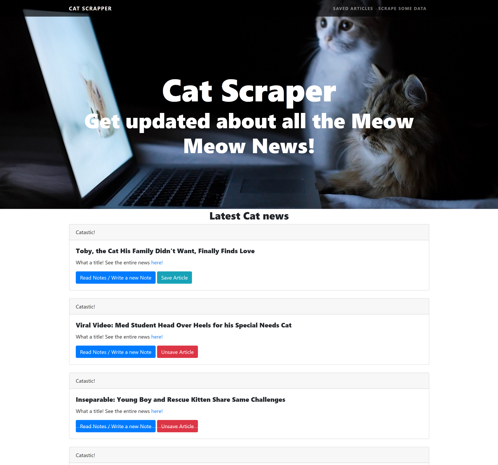

# Cat Scraper :smiley_cat: :kissing_cat: :smile_cat:



Do you love cats? Then let's get you some news about them and make you happier! :heart_eyes_cat:

## Getting Started :floppy_disk:

### Prerequisites :open_file_folder:
Make sure you have node.js installed on your computer! You can download it via the installer on the official site
```
https://nodejs.org/en/download/
```

In your terminal navigate to your specified folder, type the following to install all required packages listed in package.json:
```
npm install
```

You also must have MongoDB installed on your computer. This link will guide you to have this amazing Database Language on your machine:

[How to install MongoDB](https://docs.mongodb.com/manual/installation/)


The deployed version of this app is hosted on heroku [here](https://still-bastion-79796.herokuapp.com/)

To view this app locally on your machine type `node server.js` into your terminal to intialize the app. This will set up a local server on your computer. Navigate to the server in your browser by visiting `http://localhost:3000/`

To end the sever connection simply hold down `ctrl + c` inside of your terminal.

## Built With
* HTML5 & CSS3
* [Bootstrap](https://getbootstrap.com/) - CSS framework
* [JQuery](https://jquery.com/) - Javascript Library
* [Sweetalert2](https://sweetalert2.github.io/) - Custom alerts
* [Javascript](https://www.javascript.com/) - programming language
* [Handlebars](https://handlebarsjs.com/) - Template engine
* [Node.js](https://nodejs.org/en/) - javascript runtime
* [Express.js](https://expressjs.com/) - routing framework
* [MongoDB](https://www.mongodb.com/) - Database

### NPM Packages
* [Express](https://www.npmjs.com/package/express)
* [body-parser](https://www.npmjs.com/package/body-parser)
* [Request](https://www.npmjs.com/package/request)
* [Path](https://www.npmjs.com/package/path)
* [Axios](https://www.npmjs.com/package/axios)
* [Cheerio](https://www.npmjs.com/package/cheerio)
* [Morgan](https://www.npmjs.com/package/morgan)
* [Mongoose](https://www.npmjs.com/package/mongoose)

## Author :key:
* **Gustavo Gibo** - [gustavogibo](https://github.com/gustavogibo)